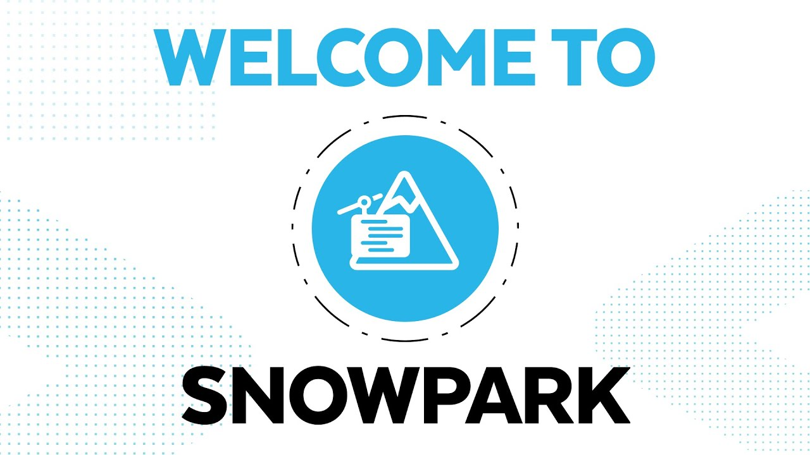
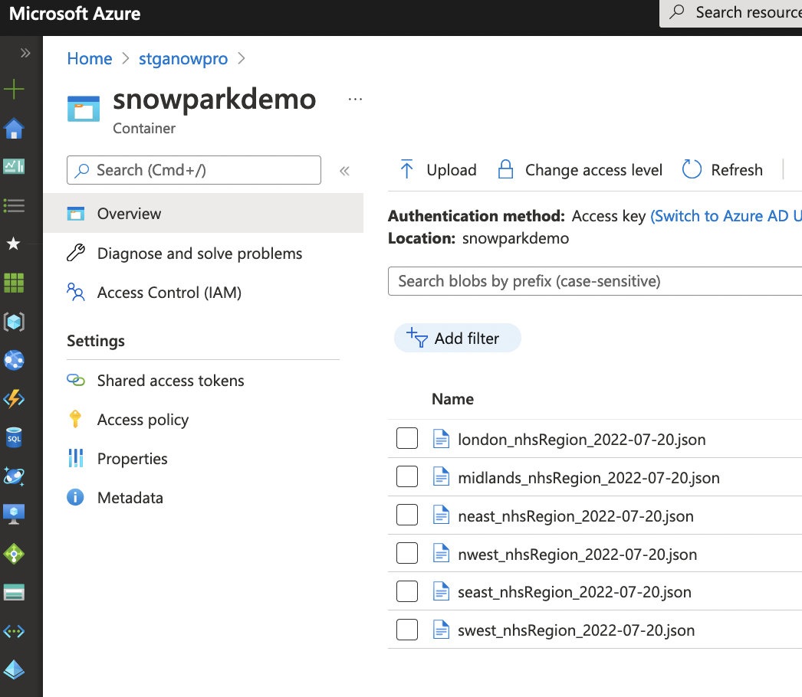
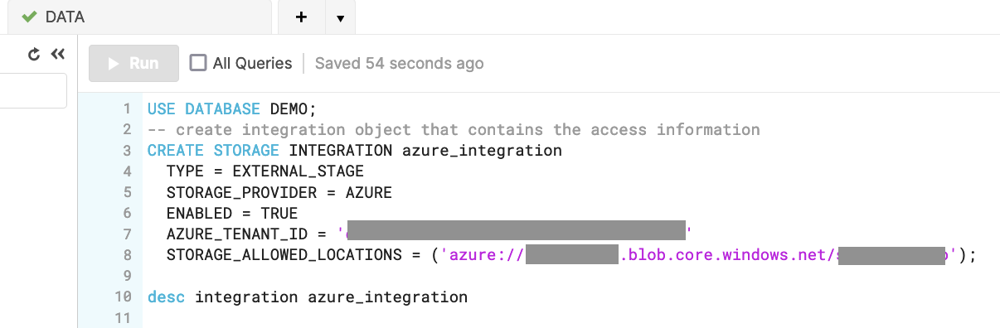
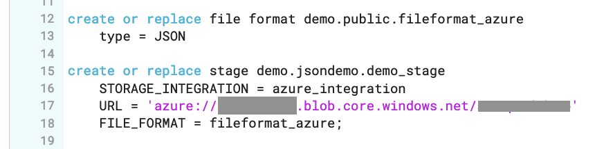
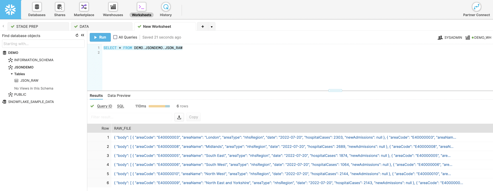

This repository is a quick introduction to **Snowpark** that was triggered by the Snowpark Day organised by Snowflake and its partners such as NTT DATA.

The data used in this demo was dowloaded from the UK Gov and this data is about the NHS COVID-19 Hospital Cases and Admimissions. The data is available in data folder, but it also can be downloaded **[here](https://coronavirus.data.gov.uk/details/download)**.


## Preparation
As these datasets are in JSON format we must have a table with a variant column to proceed with the JSON parsing in Snowflake.

To run this demo you will need to prepare these items in Snowflake:

1. Create a storage location to copy the files (Azure, AWS, GCP). In this case we have used Azure as below:


2. Create an Azure Integration (in this case), you can look at the Snowflake documentation to know more **[here](https://docs.snowflake.com/en/sql-reference/sql/create-storage-integration.html)**.


3. Create a Snowflake File Format and Stage


4. For this demonstration was created a table from the 



## Docker Build
```
DOCKER_BUILDKIT=1 docker build .  --tag snowpark-quickstart
```
## Docker Run
```
docker run -it --rm --name my-snowpark  -p 8888:8888  -v ${PWD}/workspace:/worskpace snowpark-quickstart
```

## Run the Jupyter Lab
```
jupyter-lab --allow-root
```