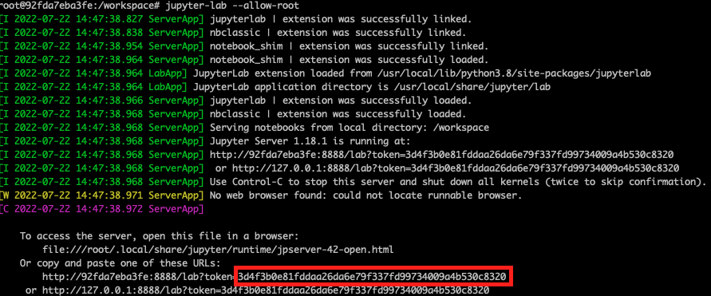

This repository is a quick introduction to **Snowpark** that was triggered by the Snowpark Day organised by Snowflake and its partners such as NTT DATA.

The data used in this demo was dowloaded from the UK Gov and this data is about the NHS COVID-19 Hospital Cases and Admimissions. The data is available in data folder, but it also can be downloaded **[here](https://coronavirus.data.gov.uk/details/download)**.


## Snowflake Dataset Preparation
As these datasets are in JSON format we must have a table with a variant column to proceed with the JSON parsing in Snowflake.

To run this demo you will need to prepare these items in Snowflake:

1. Create a storage location to copy the files (Azure, AWS, GCP). In this case we have used Azure as below:


2. Create an Azure Integration (in this case), you can look at the Snowflake documentation to know more **[here](https://docs.snowflake.com/en/sql-reference/sql/create-storage-integration.html)**:


3. Create a Snowflake File Format and Stage:


4. For this demonstration was created a table that will be consumed by the Snowpark notebook:


## Docker Preparation

To run this a docker has been prepared to simplify the libraries installation and to help us to focus on the data straight away. To run this docker image please **clone this repository and follow the instructions below**.

#### Docker Build
```
DOCKER_BUILDKIT=1 docker build .  --tag snowpark-quickstart
```
#### Docker Run
```
docker run -it --rm --name my-snowpark  -p 8888:8888  -v ${PWD}/workspace:/worskpace snowpark-quickstart
```

#### Run the Jupyter Lab
Once you are in the docker just run the command below to enable the Jupyter Lab notebook:

* Docker container prompt (illustrative)
```
root@92fda7eba3fe:/workspace#
```
* Run the command below:
```
jupyter-lab --allow-root
```
* Copy the Jupyter token informed in the prompt that will be used to access the notebook through web browser:


* Open you browser and access the address: **http://localhost:8888** and paste the token when asked and hit the **Log in** button

Now you just need to navigate to the folder notebooks within the workspace folder and open the **snowpark** notebook

## The Quick Demo notebook

This notebook (**[here](workspace/notebooks/snowpark.ipynb)**) will give you a quick start about how to use Snowpark. If you are familiar with **Apache Spark** you will see that the basic dataframe structure is the same.

To know more about Snowpark and its capabilities you can access the official documentation **[here](https://docs.snowflake.com/en/developer-guide/snowpark/index.html)**.
